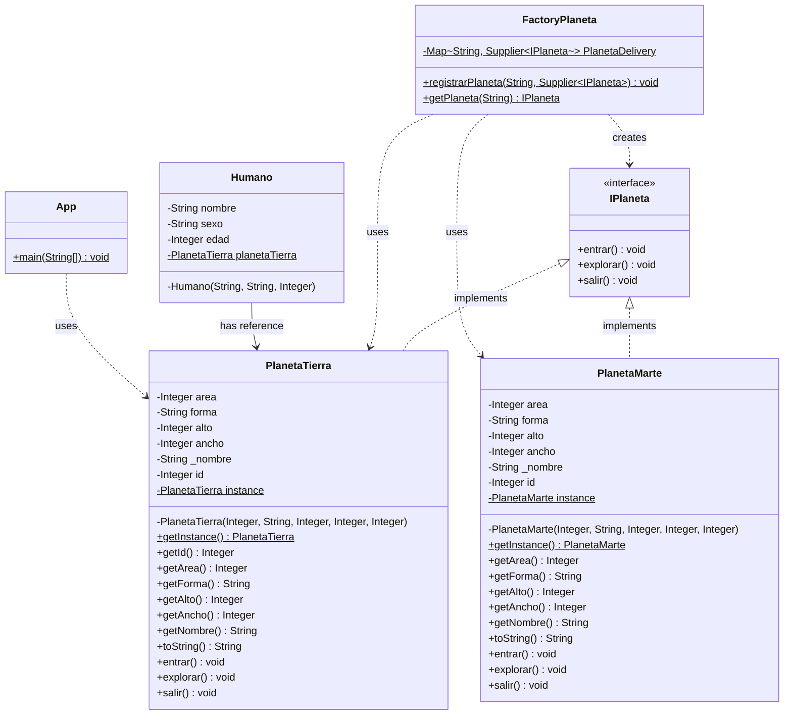
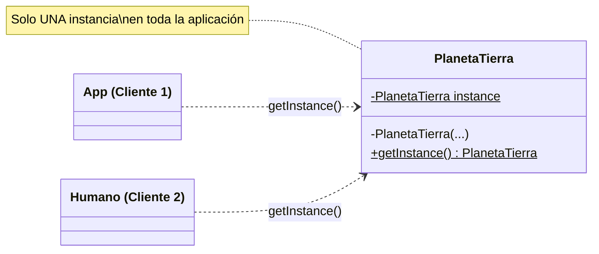
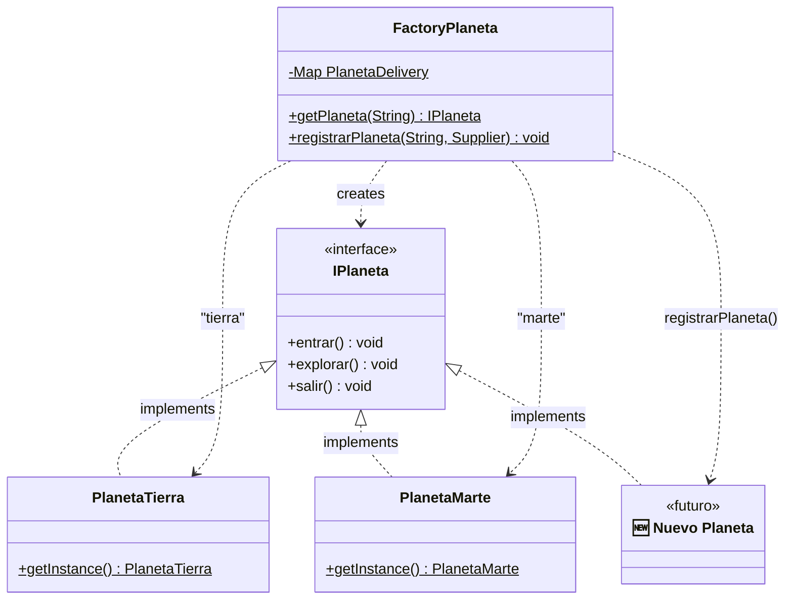
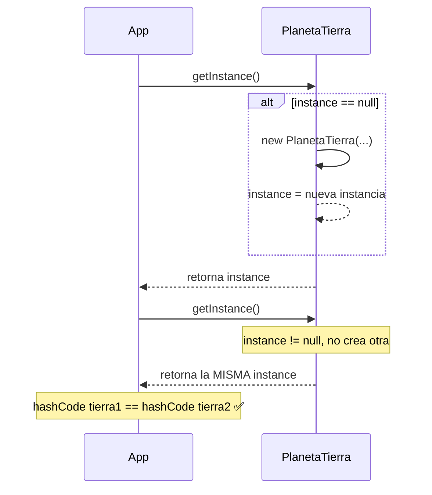
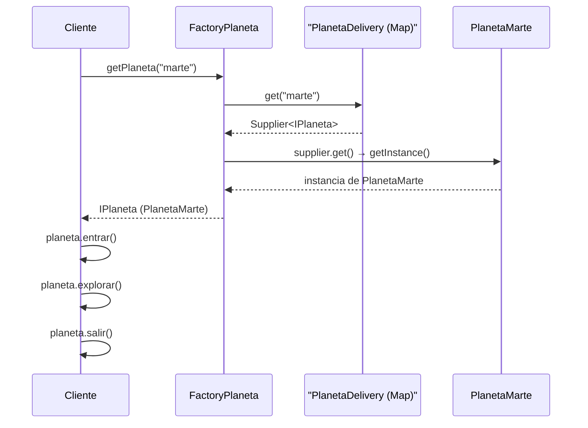
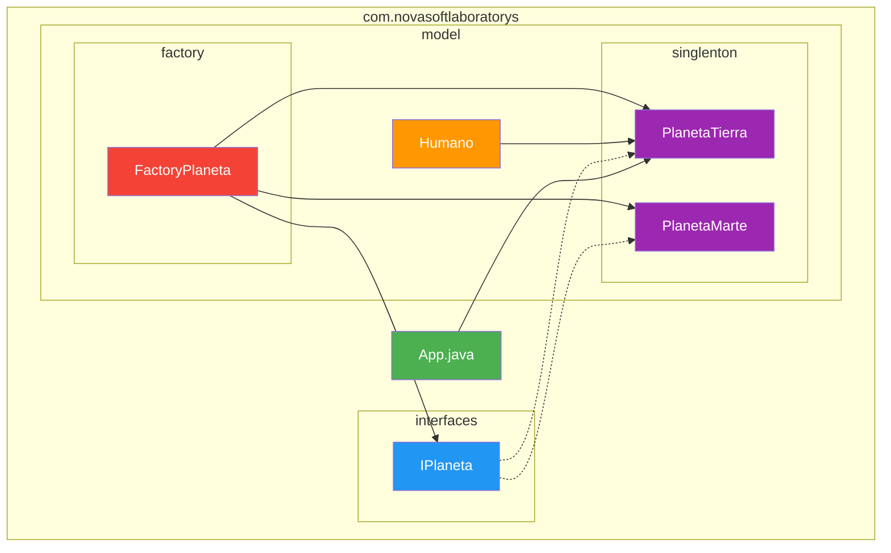

# 📐 Diagrama de Clases UML - Patrones de Diseño

**Proyecto:** `design-patterns`  
**Paquete base:** `com.novasoftlaboratorys`  

---

## Diagrama General



---

## Diagrama del Patrón Singleton



---

## Diagrama del Patrón Factory Method



---

## Diagrama de Secuencia - Singleton



---

## Diagrama de Secuencia - Factory Method



---

## Diagrama de Paquetes



---

## Leyenda

| Color | Significado |
|---|---|
| 🟢 Verde | Punto de entrada (App) |
| 🔵 Azul | Interfaz (IPlaneta) |
| 🟠 Naranja | Modelo de entidad (Humano) |
| 🟣 Púrpura | Singleton (Planetas) |
| 🔴 Rojo | Factory (FactoryPlaneta) |

---

## 🖥️ ¿Cómo ver los diagramas?

Los diagramas de este archivo están escritos en **[Mermaid](https://mermaid.js.org/)**, un lenguaje de diagramación basado en texto. Para visualizarlos como gráficos necesitas una de las siguientes opciones:

---

### Opción 1: GitHub (automático ✅)

Si subes este archivo a un repositorio de **GitHub**, los diagramas se renderizan **automáticamente** al ver el archivo `.md` en el navegador. No necesitas instalar nada.

> Simplemente haz push del archivo y ábrelo desde GitHub.

---

### Opción 2: VS Code (extensión)

1. Abre VS Code
2. Ve a **Extensions** (`Ctrl + Shift + X`)
3. Busca e instala: **`Markdown Preview Mermaid Support`** (de Matt Bierner)
4. Abre este archivo `DIAGRAMA.md`
5. Presiona `Ctrl + Shift + V` para abrir la **vista previa de Markdown**
6. Los diagramas se renderizarán automáticamente dentro de la previsualización

> 💡 **Extensión alternativa:** También puedes instalar **`Mermaid Markdown Syntax Highlighting`** para tener resaltado de sintaxis en los bloques de código Mermaid.

---

### Opción 3: IntelliJ IDEA

1. Abre IntelliJ IDEA
2. Ve a **File → Settings → Plugins**
3. Busca e instala: **`Mermaid`**
4. Reinicia el IDE
5. Abre este archivo y usa la vista previa de Markdown (`Ctrl + Shift + F10` o el ícono de preview)

---

### Opción 4: Mermaid Live Editor (navegador web)

1. Abre [https://mermaid.live](https://mermaid.live) en tu navegador
2. Copia el contenido de cualquier bloque ````mermaid`  de este archivo (solo el código, sin las comillas triples)
3. Pégalo en el editor de la izquierda
4. El diagrama se renderiza en tiempo real a la derecha
5. Puedes exportar como **PNG**, **SVG**, o compartir un link

> 🎯 **Esta es la forma más rápida** si solo quieres ver un diagrama sin instalar nada.

---

### Opción 5: Línea de comandos (generar imágenes)

Si deseas generar archivos de imagen (PNG/SVG) de los diagramas:

```bash
# 1. Instalar Mermaid CLI
npm install -g @mermaid-js/mermaid-cli

# 2. Crear un archivo con el diagrama (ejemplo: diagrama.mmd)
# Copia el contenido de un bloque mermaid al archivo .mmd

# 3. Generar la imagen
mmdc -i diagrama.mmd -o diagrama.png
mmdc -i diagrama.mmd -o diagrama.svg
```

---

### Resumen rápido

| Método | ¿Instalar algo? | Dificultad |
|---|---|---|
| **GitHub** | No | ⭐ Muy fácil |
| **Mermaid Live Editor** | No | ⭐ Muy fácil |
| **VS Code + extensión** | Sí (extensión) | ⭐⭐ Fácil |
| **IntelliJ + plugin** | Sí (plugin) | ⭐⭐ Fácil |
| **Mermaid CLI** | Sí (npm) | ⭐⭐⭐ Intermedio |

---

> 📌 **Referencia:** Para ver la documentación completa del proyecto, consultar [`DOCUMENTACION.md`](./DOCUMENTACION.md).
